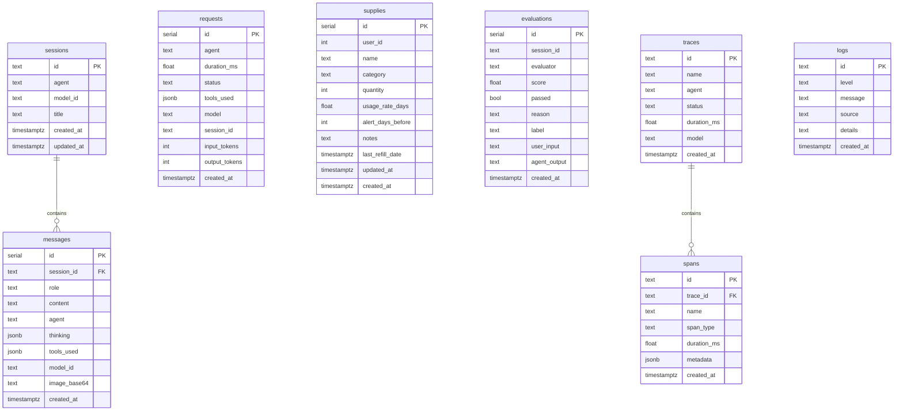
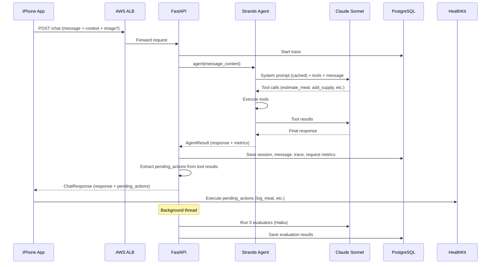

# IsletIQ Architecture

```mermaid
graph TB
    subgraph "User Devices"
        iPhone["iPhone 17 Pro<br/>iOS 26.3.1<br/>IsletIQ App"]
        Watch["Apple Watch Series 9<br/>watchOS 26.1<br/>IsletIQ Watch App"]
    end

    subgraph "On-Device Services"
        HK["Apple HealthKit<br/>Meals, Insulin, Sleep, Steps"]
        Notif["Local Notifications<br/>CGM, Pump, Supply, Meal Alerts"]
        Keychain["Keychain<br/>Dexcom Credentials"]
        SwiftData["SwiftData<br/>GlucoseReading Cache"]
    end

    subgraph "External APIs"
        Dexcom["Dexcom Share API<br/>share2.dexcom.com<br/>Live CGM Data (G7)"]
    end

    subgraph "AWS - us-east-1"
        subgraph "Networking"
            ALB["Application Load Balancer<br/>isletiq-alb-1046434082<br/>.us-east-1.elb.amazonaws.com<br/>Port 80 → 8000"]
        end

        subgraph "Compute - ECS Fargate"
            ECS["ECS Cluster: isletiq<br/>Task: isletiq-api:3<br/>0.5 vCPU / 1GB RAM"]
            
            subgraph "FastAPI Container"
                Server["server.py<br/>Port 8000"]
                
                subgraph "Strands Agents"
                    Orch["Orchestrator<br/>22 tools, vision"]
                    CGM["CGM Agent<br/>Glucose analysis"]
                    Pump["Pump Agent<br/>Insulin dosing"]
                    Nutrition["Nutrition Agent<br/>Meal estimation, vision"]
                    Supply["Supply Agent<br/>Inventory, vision"]
                    Research["Deep Research<br/>Bedrock KB"]
                end

                subgraph "Backend Services"
                    Tracking["tracking.py<br/>Traces, Logs, Metrics"]
                    Evals["evals.py<br/>5 Evaluators (Haiku)"]
                    Sessions["Session Store<br/>Chat persistence"]
                end
            end
        end

        subgraph "Database"
            RDS["RDS PostgreSQL 16<br/>db.t3.micro / 20GB<br/>isletiq-db.cmpeuk2mgulr<br/>.us-east-1.rds.amazonaws.com<br/>Port 5432"]
        end

        subgraph "Storage"
            ECR["ECR<br/>110428899092.dkr.ecr<br/>.us-east-1.amazonaws.com<br/>/isletiq-api:v3"]
        end

        subgraph "Monitoring"
            CW["CloudWatch Logs<br/>/ecs/isletiq-api"]
        end
    end

    subgraph "AI APIs"
        Anthropic["Anthropic API<br/>Claude Sonnet 4.6 (agents)<br/>Claude Haiku 4.5 (evals)<br/>Prompt Caching Enabled"]
        Bedrock["AWS Bedrock<br/>Knowledge Base<br/>Diabetes Research"]
    end

    %% Device connections
    iPhone <-->|"Bluetooth<br/>WatchConnectivity"| Watch
    iPhone --> HK
    iPhone --> Notif
    iPhone --> Keychain
    iPhone --> SwiftData
    iPhone <-->|"HTTPS<br/>Share API"| Dexcom

    %% App to backend
    iPhone <-->|"HTTP<br/>REST + SSE"| ALB
    ALB --> ECS

    %% Backend internals
    Server --> Orch
    Server --> CGM
    Server --> Pump
    Server --> Nutrition
    Server --> Supply
    Server --> Research
    Server --> Tracking
    Server --> Evals
    Server --> Sessions

    %% Backend to external
    Orch -->|"API calls"| Anthropic
    CGM --> Anthropic
    Pump --> Anthropic
    Nutrition --> Anthropic
    Supply --> Anthropic
    Evals -->|"Haiku"| Anthropic
    Research --> Bedrock

    %% Database
    Tracking --> RDS
    Sessions --> RDS
    Supply -->|"Direct SQL"| RDS
    Evals --> RDS

    %% Container
    ECS --> ECR
    ECS --> CW

    %% Styling
    classDef device fill:#0033a0,stroke:#fff,color:#fff
    classDef aws fill:#FF9900,stroke:#232F3E,color:#232F3E
    classDef api fill:#6B4FBB,stroke:#fff,color:#fff
    classDef ondevice fill:#5cb3cc,stroke:#fff,color:#fff

    class iPhone,Watch device
    class ALB,ECS,RDS,ECR,CW,Server aws
    class Anthropic,Bedrock,Dexcom api
    class HK,Notif,Keychain,SwiftData ondevice
```

## Database Schema

## Data Flow

## Cost Breakdown (per 100 users)

| Component | Monthly Cost |
|-----------|-------------|
| ECS Fargate (2 tasks, 0.5 vCPU each) | $30 |
| RDS PostgreSQL (db.t3.micro, 20GB) | $15 |
| ALB + Data Transfer | $20 |
| ECR + CloudWatch | $5 |
| Anthropic API (Sonnet, cached) | $250 |
| Anthropic API (Haiku evals) | $30 |
| **Total** | **~$350/mo** |
| **Per user** | **~$3.50/mo** |
